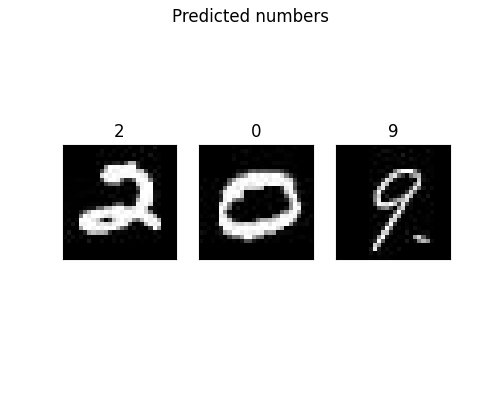
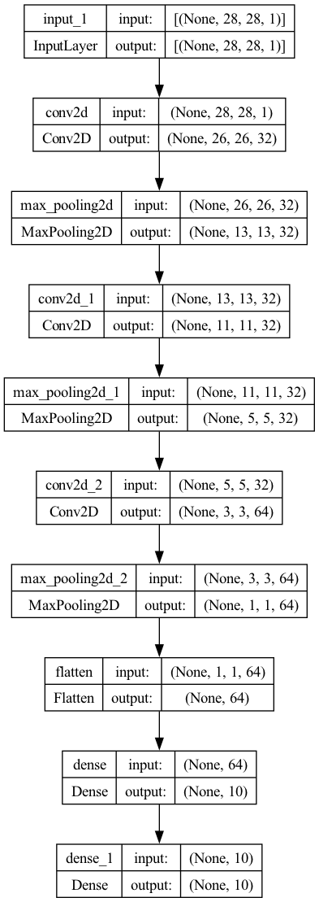

# Neural network image classifier in PyTorch and Keras

The same neural network architecture is implemented in Pytorch and in Keras/TensorFlow 
to read hand-written digits. The MNIST dataset digits is used.

## Results


## Running the code

```bash
python torch_image_nn.py
python keras_image_nn.py
```

Set the variables `do_train` and `n_epochs_to_train` in the top section of the scripts.

## Network archictecture
Neural network archictecture (28714 parameters in PyTorch, 28824 in Keras/TensorFlow):


Layers:
 - (0): Conv2d(1, 32, kernel_size=(3, 3), stride=(1, 1))
 - (1): MaxPool2d(kernel_size=(2, 2), stride=(2, 2), padding=0, dilation=1, ceil_mode=False)
 - (2): ReLU()
 - (3): Conv2d(32, 32, kernel_size=(3, 3), stride=(1, 1))
 - (4): MaxPool2d(kernel_size=(2, 2), stride=(2, 2), padding=0, dilation=1, ceil_mode=False)
 - (5): ReLU()
 - (6): Conv2d(32, 64, kernel_size=(3, 3), stride=(1, 1))
 - (7): MaxPool2d(kernel_size=(2, 2), stride=(2, 2), padding=0, dilation=1, ceil_mode=False)
 - (8): ReLU()
 - (9): Flatten(start_dim=1, end_dim=-1)
 - (10): Linear(in_features=64, out_features=10, bias=True)
  
